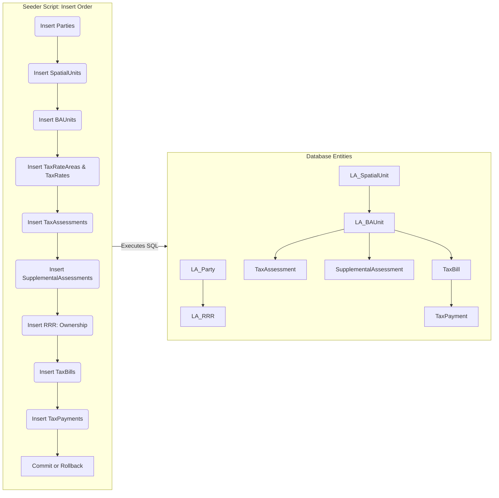

Below is an **updated README** (in Markdown) that includes **Mermaid** diagrams to enrich your explanation of the **schema** and **seeder** approach. The Mermaid diagrams illustrate both **entity relationships** (simplified) and the **seeder workflow**. You can copy this into your `README.md` and GitHub (or other platforms supporting Mermaid) will render the diagrams if enabled.

---

# LADM-Based Property Tax Schema & Seeder (Riverside)

This repository contains:

1. An **LADM-based** (Land Administration Domain Model) database schema tailored for **Riverside County** property tax administration.  
2. A **Python seeder** script that inserts **realistic** Riverside-flavored data into the database, including local addresses, agencies, businesses, partitioned tax bills, and more.

---

## 1. Schema Overview

### 1.1 Entity Diagram (Simplified)

Below is a **Mermaid diagram** showing a simplified set of **key tables** and their **relationships**. (In practice, there are more details—like triggers, partition tables, etc.—but this offers a top-level view.)

```mermaid
erDiagram

    LA_Party ||--|{ LA_RRR : has
    LA_BAUnit ||--|{ LA_RRR : has
    LA_BAUnit ||--|{ TaxAssessment : "1-to-many"
    LA_BAUnit ||--|{ SupplementalAssessment : "1-to-many"
    LA_BAUnit ||--|{ TaxBill : "1-to-many"
    TaxBill ||--|{ TaxPayment : "1-to-many"

    LA_SpatialUnit ||--|{ LA_BAUnit : "1-to-many"
    TaxRateArea ||--|{ LA_BAUnit : "1-to-many"
    TaxRate ||--|{ TaxAssessment : "linked"
    TaxRate ||--|{ SupplementalAssessment : "linked"

    LA_Party {
        BIGSERIAL party_id PK
        VARCHAR party_name
        VARCHAR party_type
        ...
    }

    LA_BAUnit {
        BIGSERIAL ba_unit_id PK
        VARCHAR unit_name
        VARCHAR assessor_parcel_number
        BIGINT spatial_unit_id FK
        BIGINT tra_id FK
        ...
    }

    LA_SpatialUnit {
        BIGSERIAL spatial_unit_id PK
        geometry geometry
        VARCHAR address
        ...
    }

    LA_RRR {
        BIGSERIAL rrr_id PK
        BIGINT ba_unit_id FK
        BIGINT party_id FK
        VARCHAR rrr_type
        ...
    }

    TaxAssessment {
        BIGSERIAL assessment_id PK
        BIGINT ba_unit_id FK
        BIGINT tax_rate_id FK
        ...
    }

    SupplementalAssessment {
        BIGSERIAL supplemental_id PK
        BIGINT ba_unit_id FK
        BIGINT tax_rate_id FK
        ...
    }

    TaxRateArea {
        BIGSERIAL tra_id PK
        VARCHAR tra_code
        ...
    }

    TaxRate {
        BIGSERIAL tax_rate_id PK
        VARCHAR rate_name
        NUMERIC rate_value
        ...
    }

    TaxBill {
        DATE bill_date PK_part
        BIGSERIAL bill_uid PK_part
        BIGINT ba_unit_id FK
        BIGINT party_id FK
        ...
    }

    TaxPayment {
        DATE payment_date PK_part
        BIGSERIAL payment_uid PK_part
        DATE bill_date FK_part
        BIGINT bill_uid FK_part
        ...
    }
```

**Notes**:
- **PK_part** indicates it is part of a **composite primary key**.  
- `TaxBill` and `TaxPayment` are **partitioned** by `bill_date` and `payment_date`, respectively, with **default partitions** for out-of-range dates.  
- `LA_BAUnit` links to `LA_SpatialUnit` for geometry/address data, and also to `TaxRateArea`.  
- `LA_RRR` connects `LA_BAUnit` and `LA_Party` with different right types (Ownership, Lease, etc.).

### 1.2 Partitioning Strategy

- **`TaxBill`**:  
  - Partition key: `(bill_date)`.  
  - Primary key: `(bill_date, bill_uid)`.  
  - Example monthly partitions: `TaxBill_2025_01`, `TaxBill_2025_02`, etc.  
  - **Default** partition (e.g. `TaxBill_default`) to catch all other dates.

- **`TaxPayment`**:  
  - Partition key: `(payment_date)`.  
  - Primary key: `(payment_date, payment_uid)`.  
  - Similarly, monthly partitions + `TaxPayment_default`.

This ensures your seeder, which may generate random dates (e.g., in 2024 or 2025), will never hit a “no partition found” error.

### 1.3 Auditing & History
- **Row-level triggers** capture `INSERT`, `UPDATE`, and `DELETE` on key tables, storing JSON data in an `audit_log`.  
- **History tables** (e.g., `LA_BAUnit_History`) keep older row versions for advanced compliance.

---

## 2. Seeder Script

We provide a Python script (`seeder.py`) that **generates realistic Riverside data** and **inserts** it into the schema. It uses:

- **Faker** for names, partial addresses, random values.  
- **Custom** logic for Riverside addresses, bounding box geometry, local businesses/agencies.  
- **Single-row inserts** with `RETURNING` to capture inserted IDs, ensuring foreign keys are valid.

### 2.1 Seeder Workflow Diagram

A **Mermaid flowchart** showing how the seeder populates the database:



**Explanation**:  
1. The script starts by creating parties (`LA_Party`).  
2. Then it inserts spatial units (`LA_SpatialUnit`), referencing them when creating basic administrative units (`LA_BAUnit`).  
3. It sets up tax rate areas and rates, then assessments, RRR, etc.  
4. Finally, it inserts `TaxBill` rows (partitioned by date) and `TaxPayment` (also partitioned). If anything fails, it **rolls back**, otherwise commits.

---

## 3. How to Use

1. **Load the Schema**  
   - Run `init.sql` in your Postgres instance or place it in `/docker-entrypoint-initdb.d/` in your Docker setup.  
   - Confirm that tables like `TaxBill_default` and `TaxPayment_default` exist to handle out-of-range dates.

2. **Install Python Dependencies**  
   ```bash
   pip install faker psycopg2-binary
   ```
   or
   ```bash
   pipenv install faker psycopg2-binary
   ```

3. **Run the Seeder**  
   - **Examples**:
     ```bash
     # Smaller
     python seeder.py --num_parties 50 --num_parcels 100 --num_bills 500

     # Medium
     python seeder.py --num_parties 500 --num_parcels 1000 --num_bills 5000

     # Large
     python seeder.py --num_parties 5000 --num_parcels 10000 --num_bills 50000
     ```
   - It will connect to your database (adjust credentials in `seeder.py`) and insert all data in a single transaction.

4. **Verify the Data**  
   - Use `psql` or a SQL client:
     ```sql
     \c property_tax_db
     SELECT * FROM ladm."LA_BAUnit" LIMIT 5;
     SELECT * FROM ladm."TaxBill" ORDER BY bill_date DESC LIMIT 5;
     SELECT * FROM ladm."TaxPayment" ORDER BY payment_date DESC LIMIT 5;
     ```

---

## 4. Notes & Next Steps

- **Performance**: For extremely large seeds (100k+ rows), consider:
  - Batching inserts or using `COPY FROM` for faster bulk loading.  
  - Parallelizing the seeder across multiple workers.  
- **Security**: You can add row-level security or separate roles if multiple offices (Assessor, Tax Collector, etc.) share the DB.  
- **Reporting**: The example includes a `ladm.mv_unpaid_tax_by_apn` materialized view for quick aggregated queries. You can add more MVs or denormalized tables.  
- **Realism**: We generate Riverside addresses, bounding box geometry, and local agencies. Adjust bounding box if you want broader coverage of the county or city specifics.
